Devoir 1 pour le cours CR460
============================

<!-- markdown-toc start - Don't edit this section. Run M-x markdown-toc-refresh-toc -->
**Table of Contents**

- [Devoir 1 pour le cours CR460](#devoir-1-pour-le-cours-cr460)
  - [Énoncé](#énoncé)
  - [Prérequis](#prérequis)
    - [Installation de jq](#installation-de-jq)
  - [Installation et configuration de VS Code](#installation-et-configuration-de-vs-code)
  - [Installation et configuration de GitHub Desktop (et Git)](#installation-et-configuration-de-github-desktop-et-git)
    - [Configuration de GitHub Desktop](#configuration-de-github-desktop)
    - [GitHub CLI](#github-cli)
      - [Installation de GitHub CLI](#installation-de-github-cli)
      - [Connexion de GitHub CLI (`gh`) au compte GitHub](#connexion-de-github-cli-gh-au-compte-github)
    - [Création d’un dépôt local Git](#création-dun-dépôt-local-git)
      - [Ajout du premier commit](#ajout-du-premier-commit)
    - [Création d’un dépôt distant avec GitHub](#création-dun-dépôt-distant-avec-github)
    - [Mise à jour du dépôt suivi (_remote_)](#mise-à-jour-du-dépôt-suivi-_remote_)
  - [Terraform CLI et Terraform cloud](#terraform-cli-et-terraform-cloud)
    - [Installation de Terraform CLI](#installation-de-terraform-cli)
    - [Test de Terraform CLI](#test-de-terraform-cli)
    - [Activation de Terraform cloud](#activation-de-terraform-cloud)
    - [Création d’une nouvelle organisation Terraform Cloud](#création-dune-nouvelle-organisation-terraform-cloud)
    - [Création d’un nouveau projet Terraform Cloud](#création-dun-nouveau-projet-terraform-cloud)
    - [Création d’un espace de travail Terraform (_workspace_)](#création-dun-espace-de-travail-terraform-_workspace_)
  - [Configuration du compte Microsoft Azure](#configuration-du-compte-microsoft-azure)
    - [Installation de Azure CLI](#installation-de-azure-cli)
    - [Connexion au compte Azure (utilitaire `az`)](#connexion-au-compte-azure-utilitaire-az)
    - [Création du _service principal_](#création-du-_service-principal_)
  - [Arrimage et connexion entre Github et Terraform](#arrimage-et-connexion-entre-github-et-terraform)
    - [Création d’un jeton pour le dépôt GitHub dans Terraform](#création-dun-jeton-pour-le-dépôt-github-dans-terraform)
    - [Configuration de l’espace de travail Terraform Cloud pour GitHub](#configuration-de-lespace-de-travail-terraform-cloud-pour-github)
    - [Création d’un flux de travail GitHub (workflow)](#création-dun-flux-de-travail-github-workflow)
    - [Ajout du jeton Terraform à GitHub (secret)](#ajout-du-jeton-terraform-à-github-secret)
    - [Ajout du fichier Terraform](#ajout-du-fichier-terraform)
  - [Arrimage et connexion entre Terraform cloud et MZ Azure](#arrimage-et-connexion-entre-terraform-cloud-et-mz-azure)
    - [Configuration du fournisseur Azure](#configuration-du-fournisseur-azure)

<!-- markdown-toc end -->

## Énoncé
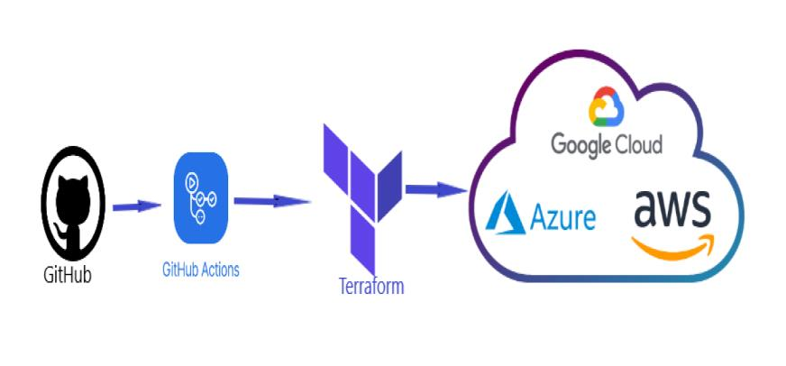

> **Mise en place d un pipeline CI/CD pour MS Azure**
> En se basant sur le diagramme ci-dessus , construire un pipeline CI/CD vers Microsoft Azure.

## Prérequis
Le playbook inclus a été conçu pour fonctionner sous [Ubuntu 22.04.3](https://releases.ubuntu.com/jammy/).  Il peut (théoriquement) fonctionner avec les distributions dérivées de Debian.  Cependant, prendre note que la présente installation [VS Code](https://code.visualstudio.com/) requiert l’utilisation de [snap](https://snapcraft.io/about).

### Installation de jq
> 📝 **Note :** Cette étape est nécessaire (ou utile) pour la création automatique d’un _service principal_ en permettant d’extraire des données _JSON_.

Pour n’installer que l’utilitaire `jq`, exécuter localement la commande suivante :

```bash
ansible-playbook --ask-become-pass -v playbook.yml --diff --tags jq
```

<details>
  <summary>Résultats de l’exécution du playbook :</summary>

```console
Using /etc/ansible/ansible.cfg as config file
BECOME password: XXXXXX
[WARNING]: provided hosts list is empty, only localhost is available. Note that the implicit localhost does not match 'all'

PLAY [Installation des logiciels du DE01 cours CR460] ******************************************************************************************************************************************************

TASK [Gathering Facts] *************************************************************************************************************************************************************************************
ok: [localhost]

TASK [Installation de jq] **********************************************************************************************************************************************************************************
Lecture des listes de paquets…
Construction de l'arbre des dépendances…
Lecture des informations d'état…
Les NOUVEAUX paquets suivants seront installés :
  jq
0 mis à jour, 1 nouvellement installés, 0 à enlever et 1 non mis à jour.
Il est nécessaire de prendre 52.5 ko dans les archives.
Après cette opération, 102 ko d'espace disque supplémentaires seront utilisés.
Réception de :1 http://gpl.savoirfairelinux.net/pub/mirrors/ubuntu jammy/main amd64 jq amd64 1.6-2.1ubuntu3 [52.5 kB]
52.5 ko réceptionnés en 0s (476 ko/s)
Sélection du paquet jq précédemment désélectionné.
(Lecture de la base de données... 
(Lecture de la base de données... 5%
(Lecture de la base de données... 10%
(Lecture de la base de données... 15%
(Lecture de la base de données... 20%
(Lecture de la base de données... 25%
(Lecture de la base de données... 30%
(Lecture de la base de données... 35%
(Lecture de la base de données... 40%
(Lecture de la base de données... 45%
(Lecture de la base de données... 50%
(Lecture de la base de données... 55%
(Lecture de la base de données... 60%
(Lecture de la base de données... 65%
(Lecture de la base de données... 70%
(Lecture de la base de données... 75%
(Lecture de la base de données... 80%
(Lecture de la base de données... 85%
(Lecture de la base de données... 90%
(Lecture de la base de données... 95%
(Lecture de la base de données... 100%
(Lecture de la base de données... 438132 fichiers et répertoires déjà installés.)
Préparation du dépaquetage de .../jq_1.6-2.1ubuntu3_amd64.deb ...
Dépaquetage de jq (1.6-2.1ubuntu3) ...
Paramétrage de jq (1.6-2.1ubuntu3) ...
Traitement des actions différées (« triggers ») pour man-db (2.10.2-1) ...
changed: [localhost] => {"cache_update_time": 1710052522, "cache_updated": false, "changed": true, "stderr": "", "stderr_lines": [], "stdout": "Lecture des listes de paquets…\nConstruction de l'arbre des dépendances…\nLecture des informations d'état…\nLes NOUVEAUX paquets suivants seront installés :\n  jq\n0 mis à jour, 1 nouvellement installés, 0 à enlever et 1 non mis à jour.\nIl est nécessaire de prendre 52.5 ko dans les archives.\nAprès cette opération, 102 ko d'espace disque supplémentaires seront utilisés.\nRéception de :1 http://gpl.savoirfairelinux.net/pub/mirrors/ubuntu jammy/main amd64 jq amd64 1.6-2.1ubuntu3 [52.5 kB]\n52.5 ko réceptionnés en 0s (476 ko/s)\nSélection du paquet jq précédemment désélectionné.\r\n(Lecture de la base de données... \r(Lecture de la base de données... 5%\r(Lecture de la base de données... 10%\r(Lecture de la base de données... 15%\r(Lecture de la base de données... 20%\r(Lecture de la base de données... 25%\r(Lecture de la base de données... 30%\r(Lecture de la base de données... 35%\r(Lecture de la base de données... 40%\r(Lecture de la base de données... 45%\r(Lecture de la base de données... 50%\r(Lecture de la base de données... 55%\r(Lecture de la base de données... 60%\r(Lecture de la base de données... 65%\r(Lecture de la base de données... 70%\r(Lecture de la base de données... 75%\r(Lecture de la base de données... 80%\r(Lecture de la base de données... 85%\r(Lecture de la base de données... 90%\r(Lecture de la base de données... 95%\r(Lecture de la base de données... 100%\r(Lecture de la base de données... 438132 fichiers et répertoires déjà installés.)\r\nPréparation du dépaquetage de .../jq_1.6-2.1ubuntu3_amd64.deb ...\r\nDépaquetage de jq (1.6-2.1ubuntu3) ...\r\nParamétrage de jq (1.6-2.1ubuntu3) ...\r\nTraitement des actions différées (« triggers ») pour man-db (2.10.2-1) ...\r\n", "stdout_lines": ["Lecture des listes de paquets…", "Construction de l'arbre des dépendances…", "Lecture des informations d'état…", "Les NOUVEAUX paquets suivants seront installés :", "  jq", "0 mis à jour, 1 nouvellement installés, 0 à enlever et 1 non mis à jour.", "Il est nécessaire de prendre 52.5 ko dans les archives.", "Après cette opération, 102 ko d'espace disque supplémentaires seront utilisés.", "Réception de :1 http://gpl.savoirfairelinux.net/pub/mirrors/ubuntu jammy/main amd64 jq amd64 1.6-2.1ubuntu3 [52.5 kB]", "52.5 ko réceptionnés en 0s (476 ko/s)", "Sélection du paquet jq précédemment désélectionné.", "(Lecture de la base de données... ", "(Lecture de la base de données... 5%", "(Lecture de la base de données... 10%", "(Lecture de la base de données... 15%", "(Lecture de la base de données... 20%", "(Lecture de la base de données... 25%", "(Lecture de la base de données... 30%", "(Lecture de la base de données... 35%", "(Lecture de la base de données... 40%", "(Lecture de la base de données... 45%", "(Lecture de la base de données... 50%", "(Lecture de la base de données... 55%", "(Lecture de la base de données... 60%", "(Lecture de la base de données... 65%", "(Lecture de la base de données... 70%", "(Lecture de la base de données... 75%", "(Lecture de la base de données... 80%", "(Lecture de la base de données... 85%", "(Lecture de la base de données... 90%", "(Lecture de la base de données... 95%", "(Lecture de la base de données... 100%", "(Lecture de la base de données... 438132 fichiers et répertoires déjà installés.)", "Préparation du dépaquetage de .../jq_1.6-2.1ubuntu3_amd64.deb ...", "Dépaquetage de jq (1.6-2.1ubuntu3) ...", "Paramétrage de jq (1.6-2.1ubuntu3) ...", "Traitement des actions différées (« triggers ») pour man-db (2.10.2-1) ..."]}

PLAY RECAP *************************************************************************************************************************************************************************************************
localhost                  : ok=2    changed=1    unreachable=0    failed=0    skipped=0    rescued=0    ignored=0
```
</details>

> 💡 **Explications** : Le playbook installe le paquet `jq`.

## Installation et configuration de VS Code
Pour n’installer que VS Code, exécuter localement la commande suivante :

```bash
ansible-playbook --ask-become-pass -v playbook.yml --diff --tags vscode
```

<details>
  <summary>Résultats de l’exécution du playbook :</summary>

```console
Using /etc/ansible/ansible.cfg as config file
BECOME password: XXXXXX
[WARNING]: provided hosts list is empty, only localhost is available. Note that the implicit localhost does not match 'all'

PLAY [Installation des logiciels du DE01 cours CR460] ******************************************************************************************************************************************************

TASK [Gathering Facts] *************************************************************************************************************************************************************************************
ok: [localhost]

TASK [Installation de VSCode] ******************************************************************************************************************************************************************************
changed: [localhost] => {"changed": true, "channel": "latest/stable", "classic": true, "cmd": "['state', 'classic', 'channel', 'dangerous', 'code']", "snap_names": ["code"], "snaps_installed": ["code"]}

PLAY RECAP *************************************************************************************************************************************************************************************************
localhost                  : ok=2    changed=1    unreachable=0    failed=0    skipped=0    rescued=0    ignored=0
```
</details>

Aperçu de VS Code sous Ubuntu :

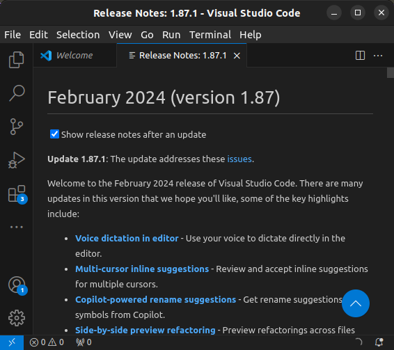

> 💡 **Explications** : Le playbook Ansible installe le snap nommé _[code](https://snapcraft.io/code)_.

## Installation et configuration de GitHub Desktop (et Git)
Pour n’installer que GitHub Desktop, exécuter la commande suivante :

```bash
ansible-playbook --ask-become-pass -v playbook.yml --diff --tags github-desktop
```

<details>
  <summary>Résultats de l’exécution du playbook :</summary>

```console
Using /etc/ansible/ansible.cfg as config file
BECOME password: XXXXXX
[WARNING]: provided hosts list is empty, only localhost is available. Note that the implicit localhost does not match 'all'

PLAY [Installation des logiciels du DE01 cours CR460] ******************************************************************************************************************************************************

TASK [Gathering Facts] *************************************************************************************************************************************************************************************
ok: [localhost]

TASK [Téléchargement de la clef PGP du dépôt] **************************************************************************************************************************************************************
changed: [localhost] => {"after": ["7FC979028B1997C1", "DE58E9B416EB1F95"], "before": [], "changed": true, "fp": "7FC979028B1997C1", "id": "7FC979028B1997C1", "key_id": "7FC979028B1997C1", "short_id": "8B1997C1"}

ASK [Ajout du dépôt GitHub Desktop] ***********************************************************************************************************************************************************************
changed: [localhost] => {"changed": true, "repo": "deb [arch=amd64 signed-by=/usr/share/keyrings/ansible_shiftkey_repo-archive-keyring.gpg] https://apt.packages.shiftkey.dev/ubuntu/ any main", "sources_added": [], "sources_removed": [], "state": "present"}

TASK [Installation de GitHub Desktop] **********************************************************************************************************************************************************************
Lecture des listes de paquets…
Construction de l'arbre des dépendances…
Lecture des informations d'état…
Paquets suggérés :
  gir1.2-gnomekeyring-1.0 libgnome-keyring0
Les NOUVEAUX paquets suivants seront installés :
  github-desktop
0 mis à jour, 1 nouvellement installés, 0 à enlever et 1 non mis à jour.
Il est nécessaire de prendre 94.6 Mo dans les archives.
Après cette opération, 345 Mo d'espace disque supplémentaires seront utilisés.
Réception de :1 https://apt.packages.shiftkey.dev/ubuntu any/main amd64 github-desktop amd64 3.3.8-linux1 [94.6 MB]
94.6 Mo réceptionnés en 12s (8052 ko/s)
Sélection du paquet github-desktop précédemment désélectionné.
(Lecture de la base de données... 
(Lecture de la base de données... 5%
(Lecture de la base de données... 10%
(Lecture de la base de données... 15%
(Lecture de la base de données... 20%
(Lecture de la base de données... 25%
(Lecture de la base de données... 30%
(Lecture de la base de données... 35%
(Lecture de la base de données... 40%
(Lecture de la base de données... 45%
(Lecture de la base de données... 50%
(Lecture de la base de données... 55%
(Lecture de la base de données... 60%
(Lecture de la base de données... 65%
(Lecture de la base de données... 70%
(Lecture de la base de données... 75%
(Lecture de la base de données... 80%
(Lecture de la base de données... 85%
(Lecture de la base de données... 90%
(Lecture de la base de données... 95%
(Lecture de la base de données... 100%
(Lecture de la base de données... 436345 fichiers et répertoires déjà installés.)
Préparation du dépaquetage de .../github-desktop_3.3.8-linux1_amd64.deb ...
Dépaquetage de github-desktop (3.3.8-linux1) ...
Paramétrage de github-desktop (3.3.8-linux1) ...
Traitement des actions différées (« triggers ») pour desktop-file-utils (0.26-1ubuntu3) ...
Traitement des actions différées (« triggers ») pour hicolor-icon-theme (0.17-2) ...
Traitement des actions différées (« triggers ») pour gnome-menus (3.36.0-1ubuntu3) ...
Traitement des actions différées (« triggers ») pour mailcap (3.70+nmu1ubuntu1) ...
changed: [localhost] => {"cache_update_time": 1710049877, "cache_updated": false, "changed": true, "stderr": "", "stderr_lines": [], "stdout": "Lecture des listes de paquets…\nConstruction de l'arbre des dépendances…\nLecture des informations d'état…\nPaquets suggérés :\n  gir1.2-gnomekeyring-1.0 libgnome-keyring0\nLes NOUVEAUX paquets suivants seront installés :\n  github-desktop\n0 mis à jour, 1 nouvellement installés, 0 à enlever et 1 non mis à jour.\nIl est nécessaire de prendre 94.6 Mo dans les archives.\nAprès cette opération, 345 Mo d'espace disque supplémentaires seront utilisés.\nRéception de :1 https://apt.packages.shiftkey.dev/ubuntu any/main amd64 github-desktop amd64 3.3.8-linux1 [94.6 MB]\n94.6 Mo réceptionnés en 12s (8052 ko/s)\nSélection du paquet github-desktop précédemment désélectionné.\r\n(Lecture de la base de données... \r(Lecture de la base de données... 5%\r(Lecture de la base de données... 10%\r(Lecture de la base de données... 15%\r(Lecture de la base de données... 20%\r(Lecture de la base de données... 25%\r(Lecture de la base de données... 30%\r(Lecture de la base de données... 35%\r(Lecture de la base de données... 40%\r(Lecture de la base de données... 45%\r(Lecture de la base de données... 50%\r(Lecture de la base de données... 55%\r(Lecture de la base de données... 60%\r(Lecture de la base de données... 65%\r(Lecture de la base de données... 70%\r(Lecture de la base de données... 75%\r(Lecture de la base de données... 80%\r(Lecture de la base de données... 85%\r(Lecture de la base de données... 90%\r(Lecture de la base de données... 95%\r(Lecture de la base de données... 100%\r(Lecture de la base de données... 436345 fichiers et répertoires déjà installés.)\r\nPréparation du dépaquetage de .../github-desktop_3.3.8-linux1_amd64.deb ...\r\nDépaquetage de github-desktop (3.3.8-linux1) ...\r\nParamétrage de github-desktop (3.3.8-linux1) ...\r\nTraitement des actions différées (« triggers ») pour desktop-file-utils (0.26-1ubuntu3) ...\r\nTraitement des actions différées (« triggers ») pour hicolor-icon-theme (0.17-2) ...\r\nTraitement des actions différées (« triggers ») pour gnome-menus (3.36.0-1ubuntu3) ...\r\nTraitement des actions différées (« triggers ») pour mailcap (3.70+nmu1ubuntu1) ...\r\n", "stdout_lines": ["Lecture des listes de paquets…", "Construction de l'arbre des dépendances…", "Lecture des informations d'état…", "Paquets suggérés :", "  gir1.2-gnomekeyring-1.0 libgnome-keyring0", "Les NOUVEAUX paquets suivants seront installés :", "  github-desktop", "0 mis à jour, 1 nouvellement installés, 0 à enlever et 1 non mis à jour.", "Il est nécessaire de prendre 94.6 Mo dans les archives.", "Après cette opération, 345 Mo d'espace disque supplémentaires seront utilisés.", "Réception de :1 https://apt.packages.shiftkey.dev/ubuntu any/main amd64 github-desktop amd64 3.3.8-linux1 [94.6 MB]", "94.6 Mo réceptionnés en 12s (8052 ko/s)", "Sélection du paquet github-desktop précédemment désélectionné.", "(Lecture de la base de données... ", "(Lecture de la base de données... 5%", "(Lecture de la base de données... 10%", "(Lecture de la base de données... 15%", "(Lecture de la base de données... 20%", "(Lecture de la base de données... 25%", "(Lecture de la base de données... 30%", "(Lecture de la base de données... 35%", "(Lecture de la base de données... 40%", "(Lecture de la base de données... 45%", "(Lecture de la base de données... 50%", "(Lecture de la base de données... 55%", "(Lecture de la base de données... 60%", "(Lecture de la base de données... 65%", "(Lecture de la base de données... 70%", "(Lecture de la base de données... 75%", "(Lecture de la base de données... 80%", "(Lecture de la base de données... 85%", "(Lecture de la base de données... 90%", "(Lecture de la base de données... 95%", "(Lecture de la base de données... 100%", "(Lecture de la base de données... 436345 fichiers et répertoires déjà installés.)", "Préparation du dépaquetage de .../github-desktop_3.3.8-linux1_amd64.deb ...", "Dépaquetage de github-desktop (3.3.8-linux1) ...", "Paramétrage de github-desktop (3.3.8-linux1) ...", "Traitement des actions différées (« triggers ») pour desktop-file-utils (0.26-1ubuntu3) ...", "Traitement des actions différées (« triggers ») pour hicolor-icon-theme (0.17-2) ...", "Traitement des actions différées (« triggers ») pour gnome-menus (3.36.0-1ubuntu3) ...", "Traitement des actions différées (« triggers ») pour mailcap (3.70+nmu1ubuntu1) ..."]}

PLAY RECAP *************************************************************************************************************************************************************************************************
localhost                  : ok=4    changed=2    unreachable=0    failed=0    skipped=0    rescued=0    ignores=0
```
</details>

> 💡 **Explications** : Le playbook télécharge premièrement la clef (PGP) d’un dépôt (non-officiel).  Le dépôt est aussi configuré.  Finalement, le paquet `github-desktop` est installé.

### Configuration de GitHub Desktop
En lançant l’application, cliquer sur « _Sign in to GitHub.com_ » :


> ⚠️ **Attention** : Puisque mon navigateur était déjà connecté à GitHub, le processus d’authentification n’était requis.

Remplir les configuration de Git pour GitHub Desktop :

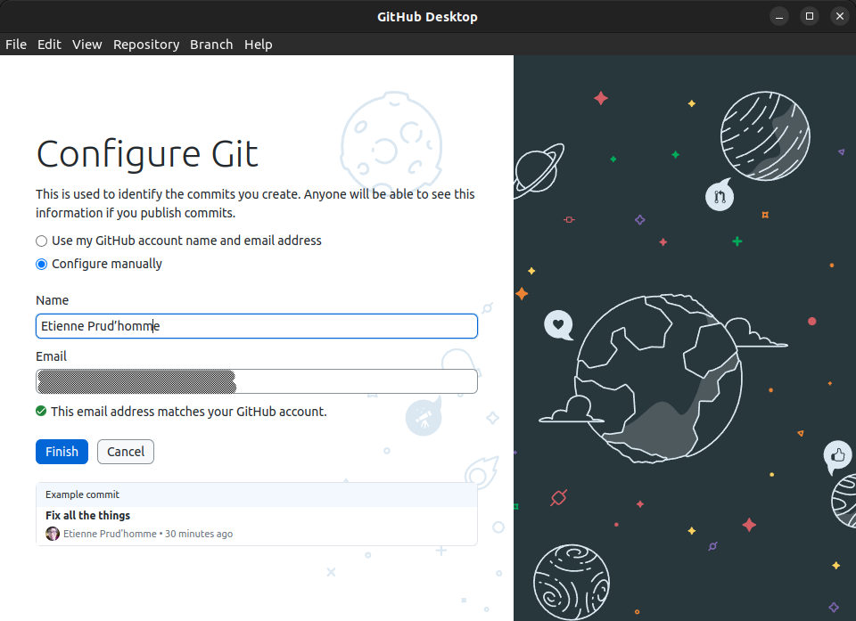

Aperçu de GitHub Desktop sous Ubuntu :

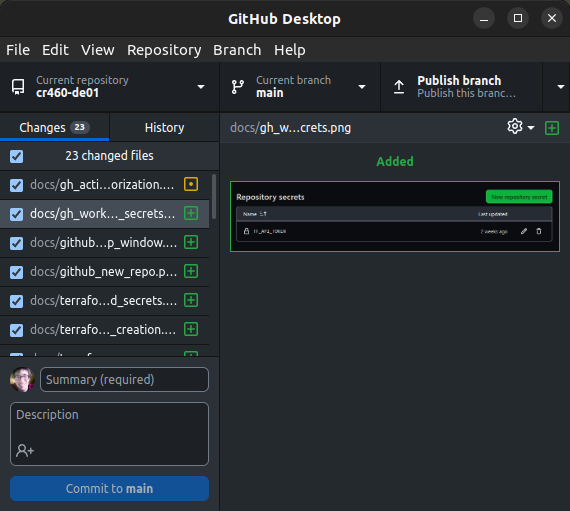

### GitHub CLI
> 📝 **Note :** Cette étape est requise pour la création automatique de dépôts distants par ligne de commande.

#### Installation de GitHub CLI
Pour n’installer que GitHub CLI, exécuter localement la commande suivante :

```bash
ansible-playbook --ask-become-pass -v playbook.yml --diff --tags github-cli
```

<details>
  <summary>Résultats de l’exécution du playbook :</summary>

```console
Using /etc/ansible/ansible.cfg as config file
BECOME password: XXXXXX
[WARNING]: provided hosts list is empty, only localhost is available. Note that the implicit localhost does not match 'all'

PLAY [Installation des logiciels du DE01 cours CR460] ******************************************************************************************************************************************************

TASK [Gathering Facts] *************************************************************************************************************************************************************************************
ok: [localhost]

TASK [Téléchargement de la clef PGP du dépôt] **************************************************************************************************************************************************************
changed: [localhost] => {"after": ["23F3D4EA75716059", "E5FAF19590714157"], "before": [], "changed": true, "fp": "23F3D4EA75716059", "id": "23F3D4EA75716059", "key_id": "23F3D4EA75716059", "short_id": "75716059"}

TASK [Ajout du dépôt GitHub CLI] ***************************************************************************************************************************************************************************
changed: [localhost] => {"changed": true, "repo": "deb [arch=amd64 signed-by=/usr/share/keyrings/ansible_githubcli_repo-archive-keyring.gpg] https://cli.github.com/packages stable main", "sources_added": [], "sources_removed": [], "state": "present"}

TASK [Installation de GitHub CLI] **************************************************************************************************************************************************************************
Lecture des listes de paquets…
Construction de l'arbre des dépendances…
Lecture des informations d'état…
Les NOUVEAUX paquets suivants seront installés :
  gh
0 mis à jour, 1 nouvellement installés, 0 à enlever et 1 non mis à jour.
Il est nécessaire de prendre 0 o/11.3 Mo dans les archives.
Après cette opération, 43.7 Mo d'espace disque supplémentaires seront utilisés.
Sélection du paquet gh précédemment désélectionné.
(Lecture de la base de données... 
(Lecture de la base de données... 5%
(Lecture de la base de données... 10%
(Lecture de la base de données... 15%
(Lecture de la base de données... 20%
(Lecture de la base de données... 25%
(Lecture de la base de données... 30%
(Lecture de la base de données... 35%
(Lecture de la base de données... 40%
(Lecture de la base de données... 45%
(Lecture de la base de données... 50%
(Lecture de la base de données... 55%
(Lecture de la base de données... 60%
(Lecture de la base de données... 65%
(Lecture de la base de données... 70%
(Lecture de la base de données... 75%
(Lecture de la base de données... 80%
(Lecture de la base de données... 85%
(Lecture de la base de données... 90%
(Lecture de la base de données... 95%
(Lecture de la base de données... 100%
(Lecture de la base de données... 437959 fichiers et répertoires déjà installés.)
Préparation du dépaquetage de .../archives/gh_2.45.0_amd64.deb ...
Dépaquetage de gh (2.45.0) ...
Paramétrage de gh (2.45.0) ...
Traitement des actions différées (« triggers ») pour man-db (2.10.2-1) ...
changed: [localhost] => {"cache_update_time": 1710051479, "cache_updated": false, "changed": true, "stderr": "", "stderr_lines": [], "stdout": "Lecture des listes de paquets…\nConstruction de l'arbre des dépendances…\nLecture des informations d'état…\nLes NOUVEAUX paquets suivants seront installés :\n  gh\n0 mis à jour, 1 nouvellement installés, 0 à enlever et 1 non mis à jour.\nIl est nécessaire de prendre 0 o/11.3 Mo dans les archives.\nAprès cette opération, 43.7 Mo d'espace disque supplémentaires seront utilisés.\nSélection du paquet gh précédemment désélectionné.\r\n(Lecture de la base de données... \r(Lecture de la base de données... 5%\r(Lecture de la base de données... 10%\r(Lecture de la base de données... 15%\r(Lecture de la base de données... 20%\r(Lecture de la base de données... 25%\r(Lecture de la base de données... 30%\r(Lecture de la base de données... 35%\r(Lecture de la base de données... 40%\r(Lecture de la base de données... 45%\r(Lecture de la base de données... 50%\r(Lecture de la base de données... 55%\r(Lecture de la base de données... 60%\r(Lecture de la base de données... 65%\r(Lecture de la base de données... 70%\r(Lecture de la base de données... 75%\r(Lecture de la base de données... 80%\r(Lecture de la base de données... 85%\r(Lecture de la base de données... 90%\r(Lecture de la base de données... 95%\r(Lecture de la base de données... 100%\r(Lecture de la base de données... 437959 fichiers et répertoires déjà installés.)\r\nPréparation du dépaquetage de .../archives/gh_2.45.0_amd64.deb ...\r\nDépaquetage de gh (2.45.0) ...\r\nParamétrage de gh (2.45.0) ...\r\nTraitement des actions différées (« triggers ») pour man-db (2.10.2-1) ...\r\n", "stdout_lines": ["Lecture des listes de paquets…", "Construction de l'arbre des dépendances…", "Lecture des informations d'état…", "Les NOUVEAUX paquets suivants seront installés :", "  gh", "0 mis à jour, 1 nouvellement installés, 0 à enlever et 1 non mis à jour.", "Il est nécessaire de prendre 0 o/11.3 Mo dans les archives.", "Après cette opération, 43.7 Mo d'espace disque supplémentaires seront utilisés.", "Sélection du paquet gh précédemment désélectionné.", "(Lecture de la base de données... ", "(Lecture de la base de données... 5%", "(Lecture de la base de données... 10%", "(Lecture de la base de données... 15%", "(Lecture de la base de données... 20%", "(Lecture de la base de données... 25%", "(Lecture de la base de données... 30%", "(Lecture de la base de données... 35%", "(Lecture de la base de données... 40%", "(Lecture de la base de données... 45%", "(Lecture de la base de données... 50%", "(Lecture de la base de données... 55%", "(Lecture de la base de données... 60%", "(Lecture de la base de données... 65%", "(Lecture de la base de données... 70%", "(Lecture de la base de données... 75%", "(Lecture de la base de données... 80%", "(Lecture de la base de données... 85%", "(Lecture de la base de données... 90%", "(Lecture de la base de données... 95%", "(Lecture de la base de données... 100%", "(Lecture de la base de données... 437959 fichiers et répertoires déjà installés.)", "Préparation du dépaquetage de .../archives/gh_2.45.0_amd64.deb ...", "Dépaquetage de gh (2.45.0) ...", "Paramétrage de gh (2.45.0) ...", "Traitement des actions différées (« triggers ») pour man-db (2.10.2-1) ..."]}

PLAY RECAP *************************************************************************************************************************************************************************************************
localhost                  : ok=4    changed=3    unreachable=0    failed=0    skipped=0    rescued=0    ignored=0
```
</details>

> 💡 **Explications** : Le playbook télécharge premièrement la clef (PGP) du dépôt officiel.  Le dépôt est aussi configuré.  Finalement, le paquet `gh` est installé.

#### Connexion de GitHub CLI (`gh`) au compte GitHub
Pour connecter l’utilitaire, exécuter localement cette commande :

```bash
gh auth login
```

<details>
  <summary>Un invite demandera d’utiliser un type de compte.  Choisir d’utiliser GitHub.com :</summary>

```console
? What account do you want to log into?  [Use arrows to move, type to filter]
> GitHub.com
  GitHub Enterprise Server
```
</details>

<details>
  <summary>Choisir l’authentification avec SSH.  Cette méthode est plus sécuritaire :</summary>

```console
? What is your preferred protocol for Git operations on this host?  [Use arrows to move, type to filter]
  HTTPS
> SSH
```
</details>

> ⚠️ **Note :** Étant donné mon utilisation de [gpg-agent](https://gist.github.com/mcattarinussi/834fc4b641ff4572018d0c665e5a94d3), ce document ne montrera pas le processus de création d’une paire de clefs SSH

<details>
  <summary>Choisir la clef publique SSH à utiliser :</summary>

```console
? Upload your SSH public key to your GitHub account? ~/.ssh/XXXX.pub
```
</details>

<details>
  <summary>Fournir un nom pour la clef publique :</summary>

```console
? Title for your SSH key: GitHub CLI
```
</details>

<details>
  <summary>Utiliser le navigateur pour authentifier GitHub CLI :</summary>

```console
? How would you like to authenticate GitHub CLI?  [Use arrows to move, type to filter]
> Login with a web browser
  Paste an authentication token
```
</details>


<details>
  <summary>Noter le code fourni et appuyer sur <kbd>entrée</kbd> pour ouvrir le navigateur web :</summary>

```console
! First copy your one-time code: XXXX-XXXX
Press Enter to open github.com in your browser...
```
</details>

Entrer le code d’activation :

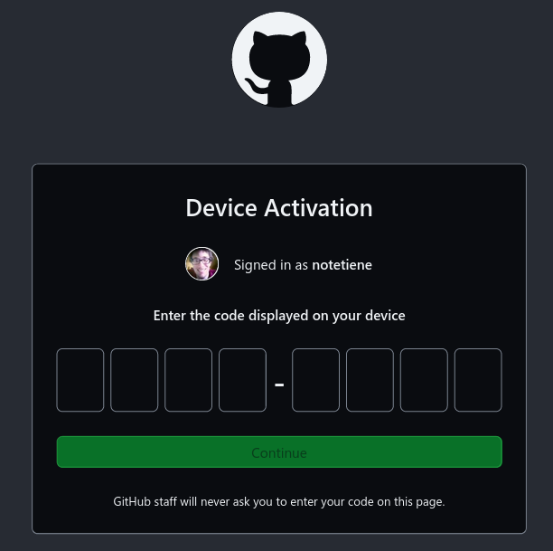

Autoriser l’application (GitHub CLI) à accéder au compte GitHub :

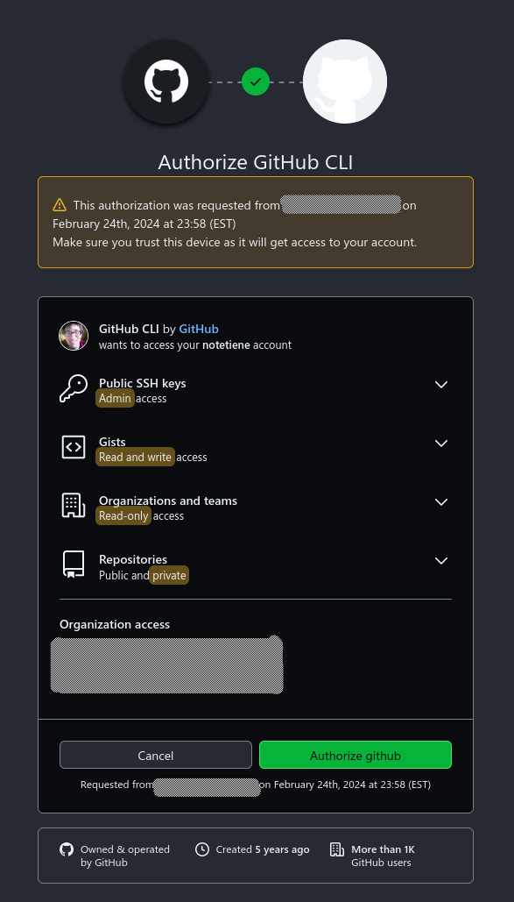

Suivant la réussite du processus d’autorisation, un message sera affiché :


<details>
  <summary>L’utilitaire affichera les actions posées :</summary>

```console
✓ Authentication complete.
- gh config set -h github.com git_protocol ssh
✓ Configured git protocol
✓ SSH key already existed on your GitHub account: ~/.ssh/XXXX.pub
✓ Logged in as notetiene
```
</details>

### Création d’un dépôt local Git
Dans un répertoire, créer un dépôt git :

```bash
REPO_NAME=cr460-de01
mkdir ~/$REPO_NAME && cd ~/$REPO_NAME
git init
```

<details>
  <summary>Résultats de la commande :</summary>

```console
Initialized empty Git repository in /home/etienne/cr460-de01/.git/
```
</details>

> 💡 **Explications** : Cette commande crée et accède à un nouveau répertoire.  Un dépôt vide (Git) est par la suite initialisé.

#### Ajout du premier commit
Pour permettre de créer un premier commit, créer un fichier vide :

```bash
REPO_NAME=cr460-de01
cd ~/$REPO_NAME
touch README.md
```

> 💡 **Explications** : Cette commande crée un fichier vide dans le répertoire du dépôt.

Ajout du fichier vide dans l’index :
```bash
git add README.md
```

(Vérification de l’index (_staging area_))

```bash
git status
```

<details>
  <summary>Résultats de la commande :</summary>

```console
On branch main

No commits yet

Changes to be committed:
  (use "git rm --cached <file>..." to unstage)
	new file:   README.md
```
</details>

Créer le premier commit :

```bash
git commit -m "Premier commit"
```

> 💡 **Explications** : Cette commande créée un commit avec l’index courant en utilisant le message « Premier commit ».

### Création d’un dépôt distant avec GitHub
Pour créer un dépôt distant, `gh` a été utilisé.

```bash
REPO_NAME=cr460-de01
gh repo create $REPO_NAME --public
```

<details>
  <summary>Le dépôt a été créé :</summary>

```console
✓ Created repository notetiene/cr460-de01 on GitHub
  https://github.com/notetiene/cr460-de01
```
</details>

> 💡 **Explications** : Cette commande créée un dépôt Git public sur le compte lié de GitHub.

Ajout d’une description au dépôt distant :

```bash
gh repo edit notetiene/cr460-de01 --description "Devoir 01 pour le cours CR460"
```

<details>
  <summary>Résultats de la commande :</summary>

```console
✓ Edited repository notetiene/cr460-de01
```
</details>

> 💡 **Explications** : Cette commande configure le message d’affichage du nouveau dépôt créé (GitHub).

### Mise à jour du dépôt suivi (_remote_)
L’URL SSH du dépôt distant doit être récupérée :

```bash
REPO_NAME=cr460-de01
REPO_SSH="$(gh repo view $REPO_NAME --json sshUrl | jq -r '.sshUrl')"
```

> 💡 **Explications** : Cette commande récupère l’URL distant configuré du dépôt sur GitHub (en format JSON).  L’utilitaire `jq` ne récupère que le champs `sshUrl`.

Ajouter le distant (en utilisant le nom `origin`) et l’URL SSH.  Forcer la synchronisation :

```bash
cd ~/$REPO_NAME
git remote add -f origin $REPO_SSH
```

<details>
  <summary>Mise à jour du distant :</summary>

```console
Updating origin
remote: Enumerating objects: 119, done.
remote: Counting objects: 100% (119/119), done.
remote: Compressing objects: 100% (69/69), done.
remote: Total 119 (delta 64), reused 103 (delta 48), pack-reused 0
Receiving objects: 100% (119/119), 684.24 KiB | 4.22 MiB/s, done.
Resolving deltas: 100% (64/64), done.
From github.com:notetiene/cr460-de01
 * [new branch]      main       -> origin/main
```
</details>
Configurer branche en amont par défaut :

```bash
git push --set-upstream origin main
```

<details>
  <summary>Résultats de la commande :</summary>

```console
branch 'main' set up to track 'origin/main'.
Everything up-to-date
```
</details>

## Terraform CLI et Terraform cloud
### Installation de Terraform CLI
Pour n’installer que Terraform, exécuter localement la commande suivante :

```bash
ansible-playbook --ask-become-pass -v playbook.yml --diff --tags terraform
```

<details>
  <summary>Résultats de l’exécution du playbook :</summary>

```console
Using /etc/ansible/ansible.cfg as config file
BECOME password: XXXXXX
[WARNING]: provided hosts list is empty, only localhost is available. Note that the implicit localhost does not match 'all'

PLAY [Installation des logiciels du DE01 cours CR460] ******************************************************************************************************************************************************

TASK [Gathering Facts] *************************************************************************************************************************************************************************************
ok: [localhost]

TASK [Téléchargement de la clef PGP de HashiCorp] **********************************************************************************************************************************************************
changed: [localhost] => {"after": ["AA16FCBCA621E701", "706E668369C085E9"], "before": [], "changed": true, "fp": "AA16FCBCA621E701", "id": "AA16FCBCA621E701", "key_id": "AA16FCBCA621E701", "short_id": "A621E701"}

TASK [Ajout du dépôt de HashiCorp] *************************************************************************************************************************************************************************
--- before: /dev/null
+++ after: /etc/apt/sources.list.d/ansible_hashicorp.list
@@ -0,0 +1 @@
+deb [arch=amd64 signed-by=/usr/share/keyrings/ansible_hashicorp_archive-keyring.gpg] https://apt.releases.hashicorp.com jammy main

changed: [localhost] => {"changed": true, "repo": "deb [arch=amd64 signed-by=/usr/share/keyrings/ansible_hashicorp_archive-keyring.gpg] https://apt.releases.hashicorp.com jammy main", "sources_added": ["/etc/apt/sources.list.d/ansible_hashicorp.list"], "sources_removed": [], "state": "present"}

TASK [Installation de Terraform] ***************************************************************************************************************************************************************************
Lecture des listes de paquets…
Construction de l'arbre des dépendances…
Lecture des informations d'état…
Les NOUVEAUX paquets suivants seront installés :
  terraform
0 mis à jour, 1 nouvellement installés, 0 à enlever et 1 non mis à jour.
Il est nécessaire de prendre 26.9 Mo dans les archives.
Après cette opération, 84.5 Mo d'espace disque supplémentaires seront utilisés.
Réception de :1 https://apt.releases.hashicorp.com jammy/main amd64 terraform amd64 1.7.4-1 [26.9 MB]
26.9 Mo réceptionnés en 3s (7794 ko/s)
Sélection du paquet terraform précédemment désélectionné.
(Lecture de la base de données... 
(Lecture de la base de données... 5%
(Lecture de la base de données... 10%
(Lecture de la base de données... 15%
(Lecture de la base de données... 20%
(Lecture de la base de données... 25%
(Lecture de la base de données... 30%
(Lecture de la base de données... 35%
(Lecture de la base de données... 40%
(Lecture de la base de données... 45%
(Lecture de la base de données... 50%
(Lecture de la base de données... 55%
(Lecture de la base de données... 60%
(Lecture de la base de données... 65%
(Lecture de la base de données... 70%
(Lecture de la base de données... 75%
(Lecture de la base de données... 80%
(Lecture de la base de données... 85%
(Lecture de la base de données... 90%
(Lecture de la base de données... 95%
(Lecture de la base de données... 100%
(Lecture de la base de données... 438148 fichiers et répertoires déjà installés.)
Préparation du dépaquetage de .../terraform_1.7.4-1_amd64.deb ...
Dépaquetage de terraform (1.7.4-1) ...
Paramétrage de terraform (1.7.4-1) ...
changed: [localhost] => {"cache_update_time": 1710051781, "cache_updated": false, "changed": true, "stderr": "", "stderr_lines": [], "stdout": "Lecture des listes de paquets…\nConstruction de l'arbre des dépendances…\nLecture des informations d'état…\nLes NOUVEAUX paquets suivants seront installés :\n  terraform\n0 mis à jour, 1 nouvellement installés, 0 à enlever et 1 non mis à jour.\nIl est nécessaire de prendre 26.9 Mo dans les archives.\nAprès cette opération, 84.5 Mo d'espace disque supplémentaires seront utilisés.\nRéception de :1 https://apt.releases.hashicorp.com jammy/main amd64 terraform amd64 1.7.4-1 [26.9 MB]\n26.9 Mo réceptionnés en 3s (7794 ko/s)\nSélection du paquet terraform précédemment désélectionné.\r\n(Lecture de la base de données... \r(Lecture de la base de données... 5%\r(Lecture de la base de données... 10%\r(Lecture de la base de données... 15%\r(Lecture de la base de données... 20%\r(Lecture de la base de données... 25%\r(Lecture de la base de données... 30%\r(Lecture de la base de données... 35%\r(Lecture de la base de données... 40%\r(Lecture de la base de données... 45%\r(Lecture de la base de données... 50%\r(Lecture de la base de données... 55%\r(Lecture de la base de données... 60%\r(Lecture de la base de données... 65%\r(Lecture de la base de données... 70%\r(Lecture de la base de données... 75%\r(Lecture de la base de données... 80%\r(Lecture de la base de données... 85%\r(Lecture de la base de données... 90%\r(Lecture de la base de données... 95%\r(Lecture de la base de données... 100%\r(Lecture de la base de données... 438148 fichiers et répertoires déjà installés.)\r\nPréparation du dépaquetage de .../terraform_1.7.4-1_amd64.deb ...\r\nDépaquetage de terraform (1.7.4-1) ...\r\nParamétrage de terraform (1.7.4-1) ...\r\n", "stdout_lines": ["Lecture des listes de paquets…", "Construction de l'arbre des dépendances…", "Lecture des informations d'état…", "Les NOUVEAUX paquets suivants seront installés :", "  terraform", "0 mis à jour, 1 nouvellement installés, 0 à enlever et 1 non mis à jour.", "Il est nécessaire de prendre 26.9 Mo dans les archives.", "Après cette opération, 84.5 Mo d'espace disque supplémentaires seront utilisés.", "Réception de :1 https://apt.releases.hashicorp.com jammy/main amd64 terraform amd64 1.7.4-1 [26.9 MB]", "26.9 Mo réceptionnés en 3s (7794 ko/s)", "Sélection du paquet terraform précédemment désélectionné.", "(Lecture de la base de données... ", "(Lecture de la base de données... 5%", "(Lecture de la base de données... 10%", "(Lecture de la base de données... 15%", "(Lecture de la base de données... 20%", "(Lecture de la base de données... 25%", "(Lecture de la base de données... 30%", "(Lecture de la base de données... 35%", "(Lecture de la base de données... 40%", "(Lecture de la base de données... 45%", "(Lecture de la base de données... 50%", "(Lecture de la base de données... 55%", "(Lecture de la base de données... 60%", "(Lecture de la base de données... 65%", "(Lecture de la base de données... 70%", "(Lecture de la base de données... 75%", "(Lecture de la base de données... 80%", "(Lecture de la base de données... 85%", "(Lecture de la base de données... 90%", "(Lecture de la base de données... 95%", "(Lecture de la base de données... 100%", "(Lecture de la base de données... 438148 fichiers et répertoires déjà installés.)", "Préparation du dépaquetage de .../terraform_1.7.4-1_amd64.deb ...", "Dépaquetage de terraform (1.7.4-1) ...", "Paramétrage de terraform (1.7.4-1) ..."]}

PLAY RECAP *************************************************************************************************************************************************************************************************
localhost                  : ok=4    changed=3    unreachable=0    failed=0    skipped=0    rescued=0    ignored=0
```
</details>

> 💡 **Explications** : Le playbook télécharge premièrement la clef (PGP) du dépôt officiel.  Le dépôt est aussi configuré.  Finalement, le paquet `terraform` est installé.

### Test de Terraform CLI
> ⚠️ **Note :** Considérant que le devoir exige la mise en place de la pratique CI/CD, l’étape de création des ressources (`plan` et  `apply`) ne s’effectuera pas sur une machine locale.

Exécuter la commande d’initialisation de terraform dans la copie du dépôt :

```bash
REPO_NAME=cr460-de01
cd ~/$REPO_NAME
terraform init
```

<details>
  <summary>Résultats de l’initialisation de <code>terraform init</code> :</summary>

```console
Initializing the backend...

Successfully configured the backend "remote"! Terraform will automatically
use this backend unless the backend configuration changes.

Initializing provider plugins...
- Finding latest version of hashicorp/azurerm...
- Installing hashicorp/azurerm v3.95.0...
- Installed hashicorp/azurerm v3.95.0 (signed by HashiCorp)

Terraform has created a lock file .terraform.lock.hcl to record the provider
selections it made above. Include this file in your version control repository
so that Terraform can guarantee to make the same selections by default when
you run "terraform init" in the future.

Terraform has been successfully initialized!

You may now begin working with Terraform. Try running "terraform plan" to see
any changes that are required for your infrastructure. All Terraform commands
should now work.

If you ever set or change modules or backend configuration for Terraform,
rerun this command to reinitialize your working directory. If you forget, other
commands will detect it and remind you to do so if necessary.
```
</details>

> 💡 **Explications** : Terraform analyse les fichiers de langage `.tf` pour configurer le répertoire courant à l’exécution d’étapes ultérieures.

Supprimer les fichiers d’initialisation :

```bash
rm -Rf .terraform/ .terraform.lock.hcl
```

### Activation de Terraform cloud
Avec Terraform installé, enregistrer le compte _cloud_ avec l’utilitaire :

```bash
terraform login
```

<details>
  <summary>Une confirmation sera demandée :</summary>

```console
If login is successful, Terraform will store the token in plain text in
the following file for use by subsequent commands:
    /home/etienne/.terraform.d/credentials.tfrc.json

*Do you want to proceed?*
  Only 'yes' will be accepted to confirm.

  *Enter a value:* yes

```
</details>

Entrer `yes`


<details>
  <summary>Un jeton sera demandé :</summary>

```console
---------------------------------------------------------------------------------

Terraform must now open a web browser to the tokens page for app.terraform.io.

If a browser does not open this automatically, open the following URL to proceed:
    https://app.terraform.io/app/settings/tokens?source=terraform-login


---------------------------------------------------------------------------------

Generate a token using your browser, and copy-paste it into this prompt.

Terraform will store the token in plain text in the following file
for use by subsequent commands:
    /home/etienne/.terraform.d/credentials.tfrc.json

Token for app.terraform.io:
  Enter a value: XXXXXX
```
</details>

Terraform va ouvrir automatiquement le navigateur web.  Se connecter à Terraform :


Créer un jeton pour Terraform login :

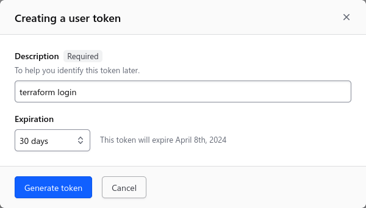

Prendre en note le jeton créé :

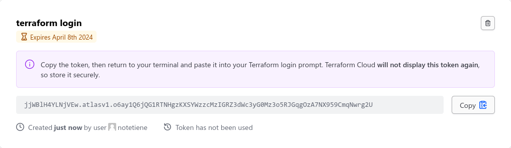


<details>
  <summary>Entrer le jeton dans le champ demandé pour `terraform login` :</summary>

```console
---------------------------------------------------------------------------------
Token for app.terraform.io:
  Enter a value: XXXXXX


Retrieved token for user notetiene


---------------------------------------------------------------------------------

                                          -
                                          -----                           -
                                          ---------                      --
                                          ---------  -                -----
                                           ---------  ------        -------
                                             -------  ---------  ----------
                                                ----  ---------- ----------
                                                  --  ---------- ----------
   Welcome to Terraform Cloud!                     -  ---------- -------
                                                      ---  ----- ---
   Documentation: terraform.io/docs/cloud             --------   -
                                                      ----------
                                                      ----------
                                                       ---------
                                                           -----
                                                               -


   New to TFC? Follow these steps to instantly apply an example configuration:

   $ git clone https://github.com/hashicorp/tfc-getting-started.git
   $ cd tfc-getting-started
   $ scripts/setup.sh
```
</details>

Terraform cloud peut maintenant être configuré localement.

### Création d’une nouvelle organisation Terraform Cloud
Pour créer un nouvelle organisation ajouter ces blocs au fichier [terraform-cloud/org.tf](./terraform-cloud/org.tf).

```terraform
# Variable declaration with default values
variable "org_name" {
  type        = string
  description = "Terraform organization name."
  default     = "polymtl-cr460"
}

variable "org_email" {
  type        = string
  description = "Terraform organization email."
  default     = "e.e.f.prudhomme@gmail.com"
}

# Create a new terraform cloud organization
resource "tfe_organization" "org" {
  name  = var.org_name
  email = var.org_email
}
```

Exécuter localement :

```bash
REPO_NAME=cr460-de01
cd ~/$REPO_NAME/terraform-cloud/
terraform init
terraform plan
terraform apply
```

<details>
  <summary>Résultats de l’exécution des commandes <code>terraform</code> :</summary>

```console
Initializing the backend...

Initializing provider plugins...
- Reusing previous version of hashicorp/tfe from the dependency lock file
- Installing hashicorp/tfe v0.52.0...
- Installed hashicorp/tfe v0.52.0 (signed by HashiCorp)

Terraform has been successfully initialized!

You may now begin working with Terraform. Try running "terraform plan" to see
any changes that are required for your infrastructure. All Terraform commands
should now work.

If you ever set or change modules or backend configuration for Terraform,
rerun this command to reinitialize your working directory. If you forget, other
commands will detect it and remind you to do so if necessary.

Terraform used the selected providers to generate the following execution plan. Resource actions
are indicated with the following symbols:
  + create

Terraform will perform the following actions:

  # tfe_organization.org will be created
  + resource "tfe_organization" "org" {
      + aggregated_commit_status_enabled                        = (known after apply)
      + allow_force_delete_workspaces                           = false
      + collaborator_auth_policy                                = "password"
      + cost_estimation_enabled                                 = (known after apply)
      + default_project_id                                      = (known after apply)
      + email                                                   = "e.e.f.prudhomme@gmail.com"
      + id                                                      = (known after apply)
      + name                                                    = "polymtl-cr460"
      + send_passing_statuses_for_untriggered_speculative_plans = (known after apply)
    }

Plan: 1 to add, 0 to change, 0 to destroy.

───────────────────────────────────────────────────────────────────────────────────────────────────

Note: You didn't use the -out option to save this plan, so Terraform can't guarantee to take
exactly these actions if you run "terraform apply" now.

Terraform used the selected providers to generate the following execution plan. Resource actions
are indicated with the following symbols:
  + create

Terraform will perform the following actions:

  # tfe_organization.org will be created
  + resource "tfe_organization" "org" {
      + aggregated_commit_status_enabled                        = (known after apply)
      + allow_force_delete_workspaces                           = false
      + collaborator_auth_policy                                = "password"
      + cost_estimation_enabled                                 = (known after apply)
      + default_project_id                                      = (known after apply)
      + email                                                   = "e.e.f.prudhomme@gmail.com"
      + id                                                      = (known after apply)
      + name                                                    = "polymtl-cr460"
      + send_passing_statuses_for_untriggered_speculative_plans = (known after apply)
    }

Plan: 1 to add, 0 to change, 0 to destroy.

Do you want to perform these actions?
  Terraform will perform the actions described above.
  Only 'yes' will be accepted to approve.

  Enter a value: yes

tfe_organization.org: Creating...
tfe_organization.org: Creation complete after 1s [id=polymtl-cr460]

```
</details>


> ⚠️ **Note :** Confirmer en entrant `yes`.

> 💡 **Explications** : Terraform crée une organisation dans Terraform Cloud en utilisant la configuration donnée.

### Création d’un nouveau projet Terraform Cloud
Pour créer un nouvelle organisation ajouter ces blocs au fichier [terraform-cloud/project.tf](./terraform-cloud/project.tf).

```terraform
# Variable declaration with default values
variable "project_name" {
  type        = string
  description = "Terraform project."
  default     = "cr460-de01"
}

# Create a new terraform cloud project
resource "tfe_project" "project" {
  organization = tfe_organization.org.name
  name         = var.project_name
}
```

Exécuter localement :

```bash
REPO_NAME=cr460-de01
cd ~/$REPO_NAME/terraform-cloud/
terraform init
terraform plan
terraform apply
```

<details>
  <summary>Résultats de l’exécution des commandes <code>terraform</code> :</summary>

```console
Initializing the backend...

Initializing provider plugins...
- Reusing previous version of hashicorp/tfe from the dependency lock file
- Using previously-installed hashicorp/tfe v0.52.0

Terraform has been successfully initialized!

You may now begin working with Terraform. Try running "terraform plan" to see
any changes that are required for your infrastructure. All Terraform commands
should now work.

If you ever set or change modules or backend configuration for Terraform,
rerun this command to reinitialize your working directory. If you forget, other
commands will detect it and remind you to do so if necessary.
tfe_organization.org: Refreshing state... [id=polymtl-cr460]

Terraform used the selected providers to generate the following execution plan. Resource actions
are indicated with the following symbols:
  + create

Terraform will perform the following actions:

  # tfe_project.project will be created
  + resource "tfe_project" "project" {
      + id           = (known after apply)
      + name         = "cr460-de01"
      + organization = "polymtl-cr460"
    }

Plan: 1 to add, 0 to change, 0 to destroy.

───────────────────────────────────────────────────────────────────────────────────────────────────

Note: You didn't use the -out option to save this plan, so Terraform can't guarantee to take
exactly these actions if you run "terraform apply" now.
tfe_organization.org: Refreshing state... [id=polymtl-cr460]

Terraform used the selected providers to generate the following execution plan. Resource actions
are indicated with the following symbols:
  + create

Terraform will perform the following actions:

  # tfe_project.project will be created
  + resource "tfe_project" "project" {
      + id           = (known after apply)
      + name         = "cr460-de01"
      + organization = "polymtl-cr460"
    }

Plan: 1 to add, 0 to change, 0 to destroy.

Do you want to perform these actions?
  Terraform will perform the actions described above.
  Only 'yes' will be accepted to approve.

  Enter a value: yes

tfe_project.project: Creating...
tfe_project.project: Creation complete after 0s [id=prj-wmnphnD1QWmaxip6]

Apply complete! Resources: 1 added, 0 changed, 0 destroyed.
```
</details>

> ⚠️ **Note :** Confirmer en entrant `yes`.

> 💡 **Explications** : Terraform crée un projet dans Terraform Cloud dans l’organisation spécifiée.

### Création d’un espace de travail Terraform (_workspace_)
Pour créer un nouvelle organisation ajouter ces blocs au fichier [terraform-cloud/project.tf](./terraform-cloud/project.tf).

```terraform
# Variable declaration with default values
variable "workspace_name" {
  type        = string
  description = "Terraform project name."
  default     = "cr460-de01-dev"
}

variable "workspace_tags" {
  # Tags should be in the form ["tag1", "tag2", ...]
  type        = list(string)
  description = "Terraform project tags."
  default     = ["polymtl", "dev"]
}

resource "tfe_workspace" "workspace" {
  # The project the workspace will be member of
  project_id   = tfe_project.project.id
  name         = var.workspace_name
  organization = tfe_organization.org.name
  tag_names    = var.workspace_tags
}
```

Exécuter localement :

```bash
REPO_NAME=cr460-de01
cd ~/$REPO_NAME/terraform-cloud/
terraform init
terraform plan
terraform apply
```

<details>
  <summary>Résultats de l’exécution des commandes <code>terraform</code> :</summary>

```console
Initializing the backend...

Initializing provider plugins...
- Reusing previous version of hashicorp/tfe from the dependency lock file
- Using previously-installed hashicorp/tfe v0.52.0

Terraform has been successfully initialized!

You may now begin working with Terraform. Try running "terraform plan" to see
any changes that are required for your infrastructure. All Terraform commands
should now work.

If you ever set or change modules or backend configuration for Terraform,
rerun this command to reinitialize your working directory. If you forget, other
commands will detect it and remind you to do so if necessary.
tfe_organization.org: Refreshing state... [id=polymtl-cr460]
tfe_project.project: Refreshing state... [id=prj-wmnphnD1QWmaxip6]

Terraform used the selected providers to generate the following execution plan. Resource actions are indicated with the following symbols:
  + create

Terraform will perform the following actions:

  # tfe_workspace.workspace will be created
  + resource "tfe_workspace" "workspace" {
      + agent_pool_id                 = (known after apply)
      + allow_destroy_plan            = true
      + auto_apply                    = false
      + auto_apply_run_trigger        = false
      + execution_mode                = (known after apply)
      + file_triggers_enabled         = true
      + force_delete                  = false
      + global_remote_state           = (known after apply)
      + html_url                      = (known after apply)
      + id                            = (known after apply)
      + name                          = "cr460-de01-dev"
      + operations                    = (known after apply)
      + organization                  = "polymtl-cr460"
      + project_id                    = "prj-wmnphnD1QWmaxip6"
      + queue_all_runs                = true
      + remote_state_consumer_ids     = (known after apply)
      + resource_count                = (known after apply)
      + speculative_enabled           = true
      + structured_run_output_enabled = true
      + tag_names                     = [
          + "dev",
          + "polymtl",
        ]
      + terraform_version             = (known after apply)
    }

Plan: 1 to add, 0 to change, 0 to destroy.

────────────────────────────────────────────────────────────────────────────────────────────────────
Note: You didn't use the -out option to save this plan, so Terraform can't guarantee to take exactlytfe_organization.org: Refreshing state... [id=polymtl-cr460]
tfe_project.project: Refreshing state... [id=prj-wmnphnD1QWmaxip6]

Terraform used the selected providers to generate the following execution plan. Resource actions are  + create

Terraform will perform the following actions:

  # tfe_workspace.workspace will be created
  + resource "tfe_workspace" "workspace" {
      + agent_pool_id                 = (known after apply)
      + allow_destroy_plan            = true
      + auto_apply                    = false
      + auto_apply_run_trigger        = false
      + execution_mode                = (known after apply)
      + file_triggers_enabled         = true
      + force_delete                  = false
      + global_remote_state           = (known after apply)
      + html_url                      = (known after apply)
      + id                            = (known after apply)
      + name                          = "cr460-de01-dev"
      + operations                    = (known after apply)
      + organization                  = "polymtl-cr460"
      + project_id                    = "prj-wmnphnD1QWmaxip6"
      + queue_all_runs                = true
      + remote_state_consumer_ids     = (known after apply)
      + resource_count                = (known after apply)
      + speculative_enabled           = true
      + structured_run_output_enabled = true
      + tag_names                     = [
          + "dev",
          + "polymtl",
        ]
      + terraform_version             = (known after apply)
    }

Plan: 1 to add, 0 to change, 0 to destroy.

Do you want to perform these actions?
  Terraform will perform the actions described above.
  Only 'yes' will be accepted to approve.

  Enter a value: yes

tfe_workspace.workspace: Creating...
tfe_workspace.workspace: Creation complete after 0s [id=ws-55Pz9DZPACwiC5e8]

Apply complete! Resources: 1 added, 0 changed, 0 destroyed.
```
</details>

> ⚠️ **Note :** Confirmer en entrant `yes`.

> 💡 **Explications** : Terraform crée un espace de travail dans Terraform Cloud dans le projet spécifié.

## Configuration du compte Microsoft Azure
### Installation de Azure CLI
> 📝 **Note :** Cette étape sera nécessaire pour la création automatique d’un _service principal_.  Dans un soucis d’automatiser le plus d’étape, utiliser cet utilitaire pourrait permettre la configuration des services d’Azure « _as Code_ ».

Pour n’installer qu’Azure CLI, exécuter localement la commande suivante :

```bash
ansible-playbook --ask-become-pass -v playbook.yml --diff --tags azure-cli
```

<details>
  <summary>Résultats de l’exécution du playbook :</summary>

```console
Using /etc/ansible/ansible.cfg as config file
BECOME password: XXXXXX
[WARNING]: provided hosts list is empty, only localhost is available. Note that the implicit localhost does not match 'all'

PLAY [Installation des logiciels du DE01 cours CR460] ******************************************************************************************************************************************************

TASK [Gathering Facts] *************************************************************************************************************************************************************************************
ok: [localhost]

TASK [Téléchargement de la clef PGP de Microsoft] **********************************************************************************************************************************************************
changed: [localhost] => {"after": ["EB3E94ADBE1229CF"], "before": [], "changed": true, "fp": "EB3E94ADBE1229CF", "id": "EB3E94ADBE1229CF", "key_id": "EB3E94ADBE1229CF", "short_id": "BE1229CF"}

TASK [Ajout du dépôt de Azure CLI] *************************************************************************************************************************************************************************
--- before: /dev/null
+++ after: /etc/apt/sources.list.d/ansible_microsoft_azure-cli.list
@@ -0,0 +1 @@
+deb [arch=amd64 signed-by=/usr/share/keyrings/ansible_microsoft_archive-keyring.gpg] https://packages.microsoft.com/repos/azure-cli/ jammy main

changed: [localhost] => {"changed": true, "repo": "deb [arch=amd64 signed-by=/usr/share/keyrings/ansible_microsoft_archive-keyring.gpg] https://packages.microsoft.com/repos/azure-cli/ jammy main", "sources_added": ["/etc/apt/sources.list.d/ansible_microsoft_azure-cli.list"], "sources_removed": [], "state": "present"}

TASK [Installation de Azure CLI] ***************************************************************************************************************************************************************************
Lecture des listes de paquets…
Construction de l'arbre des dépendances…
Lecture des informations d'état…
Les NOUVEAUX paquets suivants seront installés :
  azure-cli
0 mis à jour, 1 nouvellement installés, 0 à enlever et 1 non mis à jour.
Il est nécessaire de prendre 0 o/55.4 Mo dans les archives.
Après cette opération, 690 Mo d'espace disque supplémentaires seront utilisés.
Sélection du paquet azure-cli précédemment désélectionné.
(Lecture de la base de données... 
(Lecture de la base de données... 5%
(Lecture de la base de données... 10%
(Lecture de la base de données... 15%
(Lecture de la base de données... 20%
(Lecture de la base de données... 25%
(Lecture de la base de données... 30%
(Lecture de la base de données... 35%
(Lecture de la base de données... 40%
(Lecture de la base de données... 45%
(Lecture de la base de données... 50%
(Lecture de la base de données... 55%
(Lecture de la base de données... 60%
(Lecture de la base de données... 65%
(Lecture de la base de données... 70%
(Lecture de la base de données... 75%
(Lecture de la base de données... 80%
(Lecture de la base de données... 85%
(Lecture de la base de données... 90%
(Lecture de la base de données... 95%
(Lecture de la base de données... 100%
(Lecture de la base de données... 403828 fichiers et répertoires déjà installés.)
Préparation du dépaquetage de .../azure-cli_2.58.0-1~jammy_amd64.deb ...
Dépaquetage de azure-cli (2.58.0-1~jammy) ...
Paramétrage de azure-cli (2.58.0-1~jammy) ...
changed: [localhost] => {"cache_update_time": 1710052522, "cache_updated": false, "changed": true, "stderr": "", "stderr_lines": [], "stdout": "Lecture des listes de paquets…\nConstruction de l'arbre des dépendances…\nLecture des informations d'état…\nLes NOUVEAUX paquets suivants seront installés :\n  azure-cli\n0 mis à jour, 1 nouvellement installés, 0 à enlever et 1 non mis à jour.\nIl est nécessaire de prendre 0 o/55.4 Mo dans les archives.\nAprès cette opération, 690 Mo d'espace disque supplémentaires seront utilisés.\nSélection du paquet azure-cli précédemment désélectionné.\r\n(Lecture de la base de données... \r(Lecture de la base de données... 5%\r(Lecture de la base de données... 10%\r(Lecture de la base de données... 15%\r(Lecture de la base de données... 20%\r(Lecture de la base de données... 25%\r(Lecture de la base de données... 30%\r(Lecture de la base de données... 35%\r(Lecture de la base de données... 40%\r(Lecture de la base de données... 45%\r(Lecture de la base de données... 50%\r(Lecture de la base de données... 55%\r(Lecture de la base de données... 60%\r(Lecture de la base de données... 65%\r(Lecture de la base de données... 70%\r(Lecture de la base de données... 75%\r(Lecture de la base de données... 80%\r(Lecture de la base de données... 85%\r(Lecture de la base de données... 90%\r(Lecture de la base de données... 95%\r(Lecture de la base de données... 100%\r(Lecture de la base de données... 403828 fichiers et répertoires déjà installés.)\r\nPréparation du dépaquetage de .../azure-cli_2.58.0-1~jammy_amd64.deb ...\r\nDépaquetage de azure-cli (2.58.0-1~jammy) ...\r\nParamétrage de azure-cli (2.58.0-1~jammy) ...\r\n", "stdout_lines": ["Lecture des listes de paquets…", "Construction de l'arbre des dépendances…", "Lecture des informations d'état…", "Les NOUVEAUX paquets suivants seront installés :", "  azure-cli", "0 mis à jour, 1 nouvellement installés, 0 à enlever et 1 non mis à jour.", "Il est nécessaire de prendre 0 o/55.4 Mo dans les archives.", "Après cette opération, 690 Mo d'espace disque supplémentaires seront utilisés.", "Sélection du paquet azure-cli précédemment désélectionné.", "(Lecture de la base de données... ", "(Lecture de la base de données... 5%", "(Lecture de la base de données... 10%", "(Lecture de la base de données... 15%", "(Lecture de la base de données... 20%", "(Lecture de la base de données... 25%", "(Lecture de la base de données... 30%", "(Lecture de la base de données... 35%", "(Lecture de la base de données... 40%", "(Lecture de la base de données... 45%", "(Lecture de la base de données... 50%", "(Lecture de la base de données... 55%", "(Lecture de la base de données... 60%", "(Lecture de la base de données... 65%", "(Lecture de la base de données... 70%", "(Lecture de la base de données... 75%", "(Lecture de la base de données... 80%", "(Lecture de la base de données... 85%", "(Lecture de la base de données... 90%", "(Lecture de la base de données... 95%", "(Lecture de la base de données... 100%", "(Lecture de la base de données... 403828 fichiers et répertoires déjà installés.)", "Préparation du dépaquetage de .../azure-cli_2.58.0-1~jammy_amd64.deb ...", "Dépaquetage de azure-cli (2.58.0-1~jammy) ...", "Paramétrage de azure-cli (2.58.0-1~jammy) ..."]}

PLAY RECAP *************************************************************************************************************************************************************************************************
localhost                  : ok=4    changed=3    unreachable=0    failed=0    skipped=0    rescued=0    ignored=0
```
</details>

> 💡 **Explications** : Le playbook télécharge premièrement la clef (PGP) du dépôt d’Azure cli.  Le dépôt est aussi configuré.  Finalement, le paquet `azure-cli` est installé.

### Connexion au compte Azure (utilitaire `az`)
Lier le compte avec Azure CLI (`az`) en exécutant localement :

```bash
az login
```

L’utilitaire ouvrira une page du navigateur demandant de se connecter (ou choisir un compte connecté).  Choisir le compte à lier :


Lors d’une tentative de connexion réussie, un message s’affichera :


<details>
  <summary>Résultats de la commande <code>az login</code> :</summary>

```console
A web browser has been opened at https://login.microsoftonline.com/organizations/oauth2/v2.0/authorize. Please continue the login in the web browser. If no web browser is available or if the web browser fails to open, use device code flow with `az login --use-device-code`.
[
  {
    "cloudName": "AzureCloud",
    "homeTenantId": "HOME_TENANT_ID_HOME_TENANT_ID_HOME_T",
    "id": "ID_ID_ID_ID_ID_ID_ID_ID_ID_ID_ID_ID_",
    "isDefault": true,
    "managedByTenants": [],
    "name": "Azure subscription 1",
    "state": "Enabled",
    "tenantId": "TENANT_ID_TENANT_ID_TENANT_ID_TENANT",
    "user": {
      "name": "MAIL@MAIL.com",
      "type": "user"
    }
  }
]
```
</details>

> 💡 **Explications** : L’utilitaire az effectue enregistre des informations permettant de s’authentifier auprès d’Azure.

### Création du _service principal_
Afin de gérer l’accès aux nouvelles ressources, nous devons créer un [_service principal_](https://learn.microsoft.com/en-us/entra/identity-platform/app-objects-and-service-principals?tabs=browser).

Dans un shell de type _[POSIX](https://pubs.opengroup.org/onlinepubs/9699919799/utilities/V3_chap02.html)_, exécuter localement ceci :

```bash
# Utiliser le premier abonnement disponible
subscription_id=$(az account list --query "[0].id" --output tsv)
# Création d'un service principal
cat <(az ad sp create-for-rbac \
      --role="Contributor" \
      --scopes="/subscriptions/$subscription_id" \
      --name="git@github.com\:notetiene/cr460-de01.git") <(
    # Ajout de la propriété
    echo "{\"subscription_id\": \"$subscription_id\"}") |
    # Fusion des deux objets JSON
    jq -s '.[0] * .[1]' |
    # Mappage de propriétés Azure vers Terraform
    jq '. |= { client_id: .appId, client_secret: .password, tenant_id: .tenant, subscription_id}'
```

<details>
  <summary>Résultats de la commande :</summary>

```json
{
  "client_id": "CLIENT_ID_CLIENT_ID_CLIENT_ID_CLIENT",
  "client_secret": "CLIENT_SECRET_CLIENT_SECRET_CLIENT_SECRE",
  "tenant_id": "TENANT_ID_TENANT_ID_TENANT_ID_TENANT",
  "subscription_id": "SUBSCRIPTION_ID_SUBSCRIPTION_ID_SUBS"
}
```
</details>

> 💡 **Explications** : La commande permet de créer un nouveau service principal et de récupérer des informations utile lors de l’arrimage de de Terraform et Azure.

## Arrimage et connexion entre Github et Terraform
### Création d’un jeton pour le dépôt GitHub dans Terraform

Accéder à la page de création de jetons dans Terraform Cloud :

```bash
xdg-open https://app.terraform.io/app/settings/tokens
```

Cliquer sur « _Create an API token_ » :

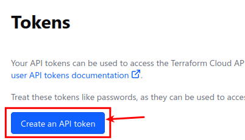

Entrer un nom de jeton (ici l’URL du dépôt GitHub) et sélectionner délais d’inactivation :

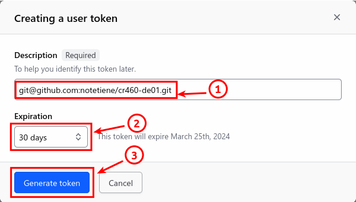

Prendre en note le jeton :

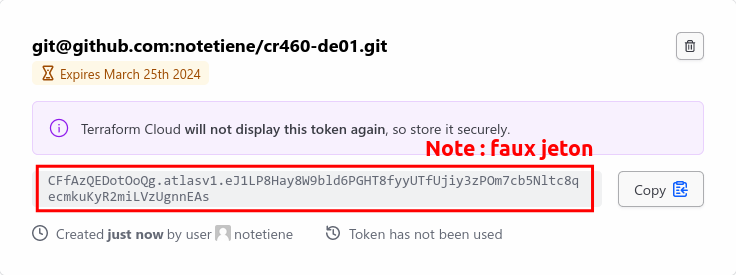

### Configuration de l’espace de travail Terraform Cloud pour GitHub
> ⚠️ **Note :** Bien qu’il soit possible de provisionner la connexion en utilisant l’outil Terraform lui-même, il s’agit d’un procédure dépassant largement le cadre de ce cours.  L’auteur manquait de temps pour utiliser cette méthode.

Accéder à la page de connexion du _VCS_ dde l’espace de travail créé :

```bash
TF_ORG="polymtl-cr460"
TF_WORKSPACE="cr460-de01-dev"
xdg-open "https://app.terraform.io/app/${TF_ORG}/workspaces/${TF_WORKSPACE}/settings/version-control/edit"
```

Choisir « _Version Control Workflow_ » :


Choisir « _GitHub_ » et « _GitHub.com_ » :

[Version Control Workflow GitHub](./docs/terraform_create_workspace_github.png)

Autoriser Terraform Cloud d’être une application tierce :

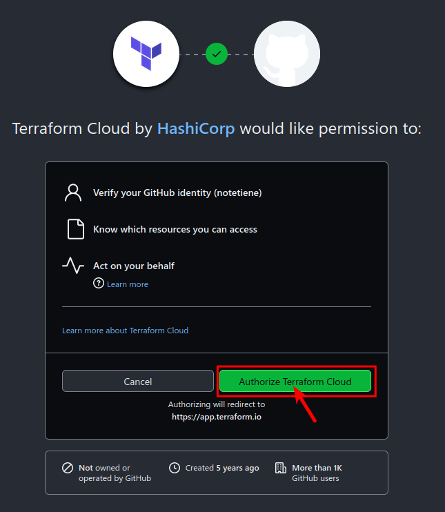

Choisir le compte GitHub à utiliser :

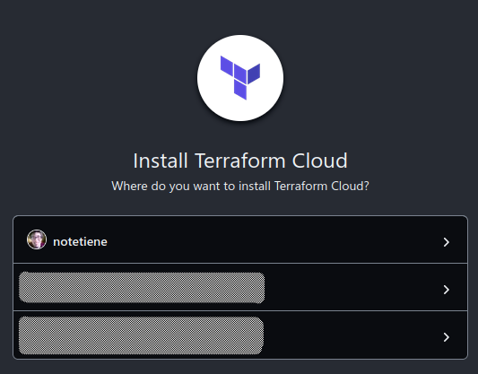

Configurer les permission d’accès :

 1. Sélectionner « _Only select repositories_ »
 2. Cliquer sur « _Select repositories_ »
 3. Sélectionner le dépôt à utiliser (ici `cr460-de01`)
 4. Cliquer sur « Install »

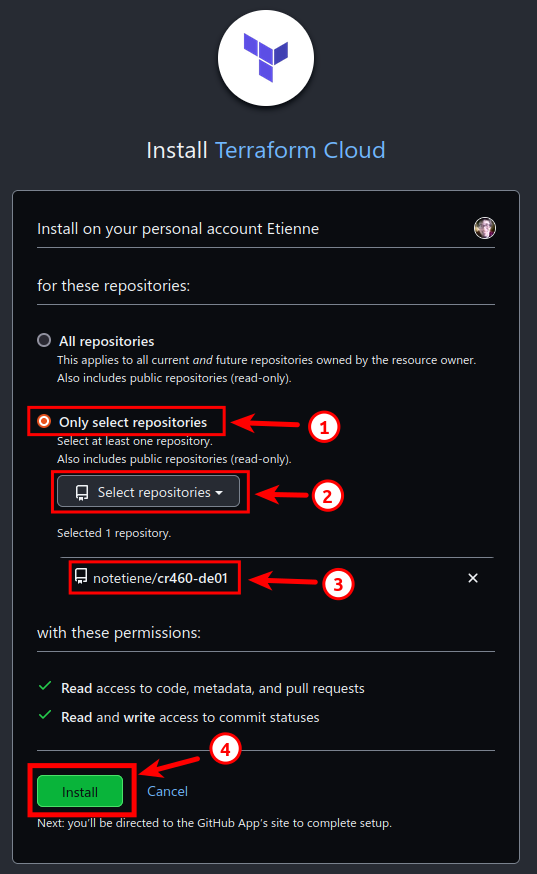

Sélectionner le dépôt maintenant disponible dans la fenêtre de Terraform Cloud :

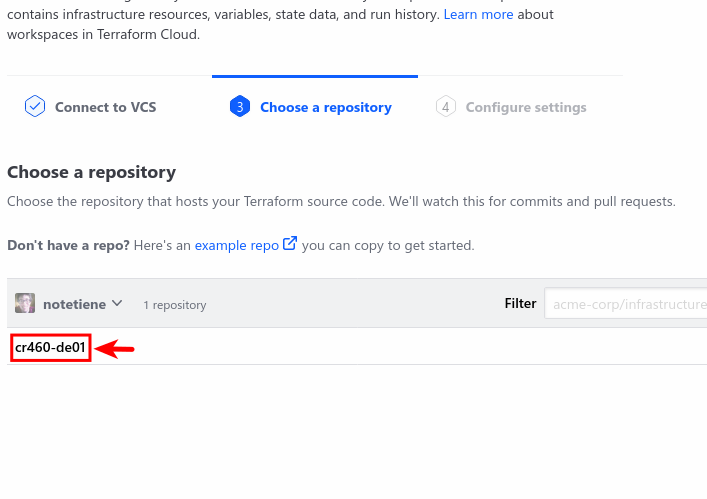

Cocher « _Auto-apply API, CLI, & VCS runs_ » et « _Auto-apply run triggers_ » :

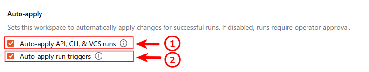

> ⚠️ **Note :** Ces dernières options permettent d'appliquer automatiquement les modifications (sans intervention manuelle) lors de la poussée pipeline.

Sauvegarder les changements :


### Création d’un flux de travail GitHub (workflow)
Lors de cet exercice, j’ai modifié partiellement le fichier de flux de travail [`setup-terraform`](https://github.com/hashicorp/setup-terraform).

Voici une copie du fichier modifié :

<details>
  <summary><a href=".github/workflows/terraform.yml"><code>.github/workflows/terraform.yml</code></a></summary>

```yaml
---
name: "Terraform"

# yamllint disable-line rule:truthy
on:
  push:
    branches: ["main"]
  pull_request:

permissions:
  contents: read

jobs:
  terraform:
    name: "Terraform"
    runs-on: ubuntu-latest
    environment: production

    # Use the Bash shell regardless whether the GitHub Actions runner
    # is ubuntu-latest, macos-latest, or windows-latest
    defaults:
      run:
        shell: bash

    steps:
      # Checkout the repository to the GitHub Actions runner
      - name: Checkout
        uses: actions/checkout@v3

      # Install the latest version of Terraform CLI and configure the
      # Terraform CLI configuration file with a Terraform Cloud user
      # API token
      - name: Setup Terraform
        uses: hashicorp/setup-terraform@v1
        with:
          cli_config_credentials_token: ${{ secrets.TF_API_TOKEN }}

      # Initialize a new or existing Terraform working directory by
      # creating initial files, loading any remote state, downloading
      # modules, etc.
      - name: Terraform Init
        run: terraform init

      # Checks that all Terraform configuration files adhere to a
      # canonical format
      - name: Terraform Format
        run: terraform fmt -check

      # Generates an execution plan for Terraform
      - name: Terraform Plan
        run: terraform plan -input=false

        # On push to "main", build or change infrastructure according
        # to Terraform configuration files
        #
        # Note: It is recommended to set up a required "strict" status
        # check in your repository for "Terraform Cloud". See the
        # documentation on "strict" required status checks for more
        # information:
        # https://help.github.com/en/github/administering-a-repository/types-of-required-status-checks
      - name: Terraform Apply
        if: github.ref == 'refs/heads/"main"' && github.event_name == 'push'
        run: terraform apply -auto-approve -input=false
```
</details>

### Ajout du jeton Terraform à GitHub (secret)
Afin de préserver la confidentialité du jeton (token) de l’API Terraform Cloud, celui-ci doit être enregistré dans les secrets du dépôt.

Pour créer un nouvelle organisation ajouter ces blocs au fichier [terraform-cloud/github_secrets.tf](./terraform-cloud/github_secrets.tf).

```terraform
# Variable declaration with default values
variable "gh_repo" {
  type        = string
  description = "GitHub repository."
  default     = "cr460-de01"
}

variable "secret_name" {
  type        = string
  description = "GitHub Actions secret name."
  default     = "TF_API_TOKEN"
}

variable "secret_value" {
  # The value should not be displayed
  sensitive   = true
  type        = string
  description = "GitHub Actions secret value."
}

# Create a GitHub Actions secret on repository
resource "github_actions_secret" "secret" {
  repository      = var.gh_repo
  secret_name     = var.secret_name
  plaintext_value = var.secret_value
}
```

Exécuter localement :

```bash
REPO_NAME=cr460-de01
cd ~/$REPO_NAME/terraform-cloud/
terraform init
terraform plan
terraform apply
```

<details>
  <summary>Résultats de l’exécution des commandes <code>terraform</code> :</summary>

```console
Initializing the backend...

Initializing provider plugins...
- Reusing previous version of hashicorp/tfe from the dependency lock file
- Reusing previous version of hashicorp/github from the dependency lock file
- Using previously-installed hashicorp/tfe v0.52.0
- Using previously-installed hashicorp/github v6.1.0

╷
│ Warning: Additional provider information from registry
│ 
│ The remote registry returned warnings for registry.terraform.io/hashicorp/github:
│ - For users on Terraform 0.13 or greater, this provider has moved to integrations/github. Please
│ update your source in required_providers.
╵

Terraform has been successfully initialized!

You may now begin working with Terraform. Try running "terraform plan" to see
any changes that are required for your infrastructure. All Terraform commands
should now work.

If you ever set or change modules or backend configuration for Terraform,
rerun this command to reinitialize your working directory. If you forget, other
commands will detect it and remind you to do so if necessary.
var.secret_value
  GitHub Actions secret value.

  Enter a value: 

tfe_organization.org: Refreshing state... [id=polymtl-cr460]
tfe_project.project: Refreshing state... [id=prj-wmnphnD1QWmaxip6]
tfe_workspace.cr460-de01-dev: Refreshing state... [id=ws-55Pz9DZPACwiC5e8]

Terraform used the selected providers to generate the following execution plan. Resource actions
are indicated with the following symbols:
  + create

Terraform will perform the following actions:

  # github_actions_secret.secret will be created
  + resource "github_actions_secret" "secret" {
      + created_at  = (known after apply)
      + id          = (known after apply)
      + repository  = "cr460-de01"
      + secret_name = "TF_API_TOKEN"
      + updated_at  = (known after apply)
    }

Plan: 1 to add, 0 to change, 0 to destroy.

───────────────────────────────────────────────────────────────────────────────────────────────────

Note: You didn't use the -out option to save this plan, so Terraform can't guarantee to take
exactly these actions if you run "terraform apply" now.
var.secret_value
  GitHub Actions secret value.

  Enter a value: 

tfe_organization.org: Refreshing state... [id=polymtl-cr460]
tfe_project.project: Refreshing state... [id=prj-wmnphnD1QWmaxip6]
tfe_workspace.cr460-de01-dev: Refreshing state... [id=ws-55Pz9DZPACwiC5e8]

Terraform used the selected providers to generate the following execution plan. Resource actions
are indicated with the following symbols:
  + create

Terraform will perform the following actions:

  # github_actions_secret.secret will be created
  + resource "github_actions_secret" "secret" {
      + created_at      = (known after apply)
      + id              = (known after apply)
      + plaintext_value = (sensitive value)
      + repository      = "cr460-de01"
      + secret_name     = "TF_API_TOKEN"
      + updated_at      = (known after apply)
    }

Plan: 1 to add, 0 to change, 0 to destroy.

Do you want to perform these actions?
  Terraform will perform the actions described above.
  Only 'yes' will be accepted to approve.

  Enter a value: yes

github_actions_secret.secret: Creating...
github_actions_secret.secret: Creation complete after 2s [id=cr460-de01:TF_API_TOKEN]

Apply complete! Resources: 1 added, 0 changed, 0 destroyed.
```
</details>

> ⚠️ **Note :** La valeur du jeton Terraform Cloud doit être entrée.

> ⚠️ **Note :** Confirmer en entrant `yes`.

> 💡 **Explications** : Terraform configure un secret nommé `TF_API_TOKEN` dans les secrets GitHub Actions dans le dépôt.

Vérification :

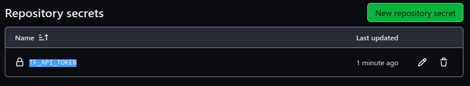

### Ajout du fichier Terraform
Créer un fichier nommé `main.tf`

<details>
  <summary><a href="./main.tf"><code>main.tf</code></a></summary>

```terraform
# Enforce using Terraform cloud
terraform {
  # Note: this block cannot take variables
  backend "remote" {
    organization = "polymtl-cr460"

    workspaces {
      name = "cr460-de01-dev"
    }
  }
}
```
</details>

> 💡 **Explications** : Ce fichier permet de lancer de déléguer l’exécution à Terraform Cloud en utilisant l’organisation et un espace de travail.

## Arrimage et connexion entre Terraform cloud et MZ Azure
### Configuration du fournisseur Azure
Ajouter le founisseur Azure dans la configuration Terraform.

<details>
  <summary><a href="./main.tf"><code>main.tf</code> (suite)</a></summary>

```terraform
# Azure variables
variable "subscription_id" {
  description = "Azure subscription ID."
  type        = string
  sensitive   = true
}

variable "client_id" {
  description = "Azure client ID."
  type        = string
  sensitive   = true
}
variable "client_secret" {
  description = "Azure client secret."
  type        = string
  sensitive   = true
}
variable "tenant_id" {
  description = "Azure tenant ID."
  type        = string
  sensitive   = true
}

provider "azurerm" {
  features {}
  subscription_id = var.subscription_id
  client_id       = var.client_id
  client_secret   = var.client_secret
  tenant_id       = var.tenant_id
}
```
</details>

> 💡 **Explications** : Terraform configure l’utilisation d’Azure comme fournisseur.
