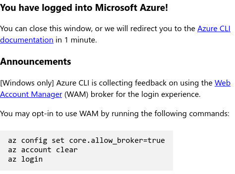
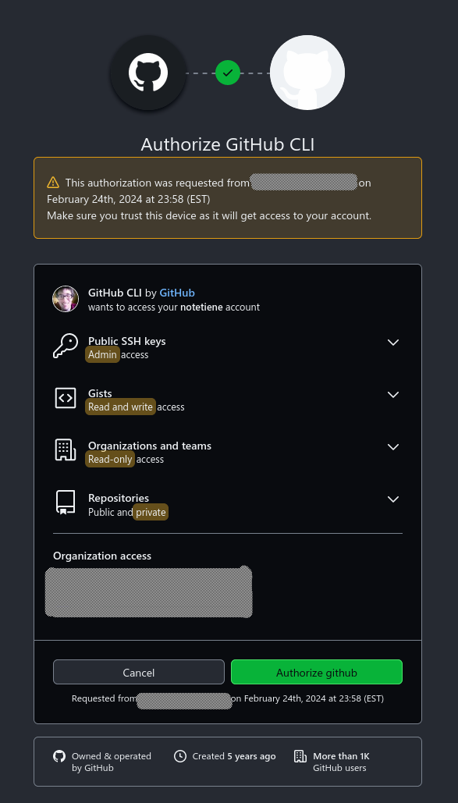

Devoir 1 pour le cours CR460
===================================

Ce projet est un
[playbook](https://docs.ansible.com/ansible/latest/playbook_guide/playbooks_intro.html)
(désolé pas trouvé de traduction officielle) du cours
[CR460](https://www.polymtl.ca/programmes/cours/infonuagique) de
[PolyMTL](https://www.polymtl.ca/).

**Note pour les prochains étudiants** : ce n’est absolument pas
nécessaire et vous n’aurez pas à utiliser
[Ansible](https://www.ansible.com/).

Enfin, je crois que c’est le premier LIZEZMOI écrit en français (et
mon dernier je l’espère).  Les **README devraient être écrits en
anglais** et par la suite traduits.

Fonctionnalités
-----------------

 1. [VS Code](https://code.visualstudio.com/)
    1. Installation (paquet snap)
 2. [GitHub Desktop](https://desktop.github.com/)
    1. Configuration du
       [dépôt](https://gist.github.com/berkorbay/6feda478a00b0432d13f1fc0a50467f1)
       (non-officiel)
    2. Installation
 3. [GitHub CLI](https://cli.github.com/)
    1. Configuration du
       [dépôt](https://github.com/cli/cli/blob/trunk/docs/install_linux.md)
 4. [Terraform](https://www.terraform.io/)
    1. Configuration du [dépôt
       HashiCorp](https://developer.hashicorp.com/terraform/cli/install/apt)
    2. Installation
 4. [Azure CLI](https://github.com/Azure/azure-cli)
    1. Configuratoin du dépôt [Azure
       CLI](https://learn.microsoft.com/en-us/cli/azure/install-azure-cli-linux?pivots=apt#option-2-step-by-step-installation-instructions)
    2. Installation
 5. [jq](https://jqlang.github.io/jq/)
    1. Installation

Prérequis
----------

Le playbook a été conçu pour fonctionner sous [Ubuntu
22.04.3](https://releases.ubuntu.com/jammy/).  Il peut (théoriquement)
fonctionner avec les distributions dérivées de Debian.  Cependant,
prendre note que la présente installation [VS
Code](https://code.visualstudio.com/) requiert l’utilisation de
[snap](https://snapcraft.io/about).

Utilisation
-------------

Il faut tout d’abord installer [Ansible](https://www.ansible.com/).

Le dépôt doit par la suite être cloné comme suit :

```bash
git clone https://github.com/notetiene/cr460-de01.git
```

Dans le répertoire, exécuter le playbook (et voir les changements) :
```bash
ansible-playbook --ask-become-pass -v playbook.yml --diff
```

### Activation de Terraform cloud

**Note** : Cette étape est non nécessaire pour l’utilisation du
pipeline, elle est cependant très utile pour le développement local.

Après l’installation de Terraform, la commande suivante doit être
entrée pour lier le compte avec l’utilitaire :

```bash
terraform login
```

```console
If login is successful, Terraform will store the token in plain text in
the following file for use by subsequent commands:
    /home/etienne/.terraform.d/credentials.tfrc.json

*Do you want to proceed?*
  Only 'yes' will be accepted to confirm.

  *Enter a value:* yes

```

Entrer `yes`

Par la suite, se connecter à terraform dans le navigateur:


```console
---------------------------------------------------------------------------------

Terraform must now open a web browser to the tokens page for app.terraform.io.

If a browser does not open this automatically, open the following URL to proceed:
    https://app.terraform.io/app/settings/tokens?source=terraform-login


Token for app.terraform.io:
  Enter a value: 


Retrieved token for user notetiene


---------------------------------------------------------------------------------

                                          -                                
                                          -----                           -
                                          ---------                      --
                                          ---------  -                -----
                                           ---------  ------        -------
                                             -------  ---------  ----------
                                                ----  ---------- ----------
                                                  --  ---------- ----------
   Welcome to Terraform Cloud!                     -  ---------- -------
                                                      ---  ----- ---
   Documentation: terraform.io/docs/cloud             --------   -
                                                      ----------
                                                      ----------
                                                       ---------
                                                           -----
                                                               -


   New to TFC? Follow these steps to instantly apply an example configuration:

   $ git clone https://github.com/hashicorp/tfc-getting-started.git
   $ cd tfc-getting-started
   $ scripts/setup.sh
```

### Activation de Azure CLI

Après l’installation d’azure CLI, la commande suivante doit être
entrée pour lier le compte avec l’utilitaire :

```bash
az login
```

Une fenêtre demandera la connexion au compte :


Si l’opération est réussie, une affichera ceci :



Création d’un dépôt git
--------------------------
Dans un répertoire, créer un dépôt git :

```bash
mkdir cr460-de01 && cd cr460-de01
git init
```

```console
Initialized empty Git repository in /home/etienne/cr460-de01/.git/
```

Création d’un dépôt distant avec GitHub
--------------------------------------------

```bash
gh auth login
```

```console
? What account do you want to log into?  [Use arrows to move, type to filter]
> GitHub.com
  GitHub Enterprise Server
 ? What is your preferred protocol for Git operations on this host?  [Use arrows to move, type to filter]
  HTTPS
> SSH
? Upload your SSH public key to your GitHub account? ~/.ssh/XXXX.pub
? Title for your SSH key: GitHub CLI
? How would you like to authenticate GitHub CLI?  [Use arrows to move, type to filter]
> Login with a web browser
  Paste an authentication token
? How would you like to authenticate GitHub CLI? Login with a web browser

! First copy your one-time code: XXXX-XXXX
Press Enter to open github.com in your browser...
✓ Authentication complete.
- gh config set -h github.com git_protocol ssh
✓ Configured git protocol
✓ SSH key already existed on your GitHub account: ~/.ssh/XXXX.pub
✓ Logged in as notetiene
```


Une fenêtre ouvrira demander le code d’autorisation :


Autoriser l’appliation (GitHub CLI) :



Une fenêtre affichant la réussite :


```bash
REPO_NAME=cr460-de01-2
gh repo create $REPO_NAME --public
REPO_SSH="$(gh repo view $REPO_NAME --json sshUrl | jq -r '.sshUrl')"
git clone $REPO_SSH $REPO_NAME
cd $REPO_NAME
```

```console
✓ Created repository notetiene/cr460-de01-2 on GitHub
  https://github.com/notetiene/cr460-de01-2
Cloning into 'cr460-de01-2'...
warning: You appear to have cloned an empty repository.
```

Ajout de description au dépôt :

```bash
gh repo edit notetiene/cr460-de01 --description "Devoir 01 pour le cours CR460"
```

```console
✓ Edited repository notetiene/cr460-de01
```

License
-------

cr460-de01 is free software: you can redistribute it and/or modify it
under the terms of the GNU General Public License as published by the
Free Software Foundation, either version 3 of the License, or (at your
option) any later version.

cr460-de01 is distributed in the hope that it will be useful, but
WITHOUT ANY WARRANTY; without even the implied warranty of
MERCHANTABILITY or FITNESS FOR A PARTICULAR PURPOSE.  See the GNU
General Public License for more details.

You should have received a copy of the GNU General Public License
along with cr460-de01.  If not, see <https://www.gnu.org/licenses/>.
